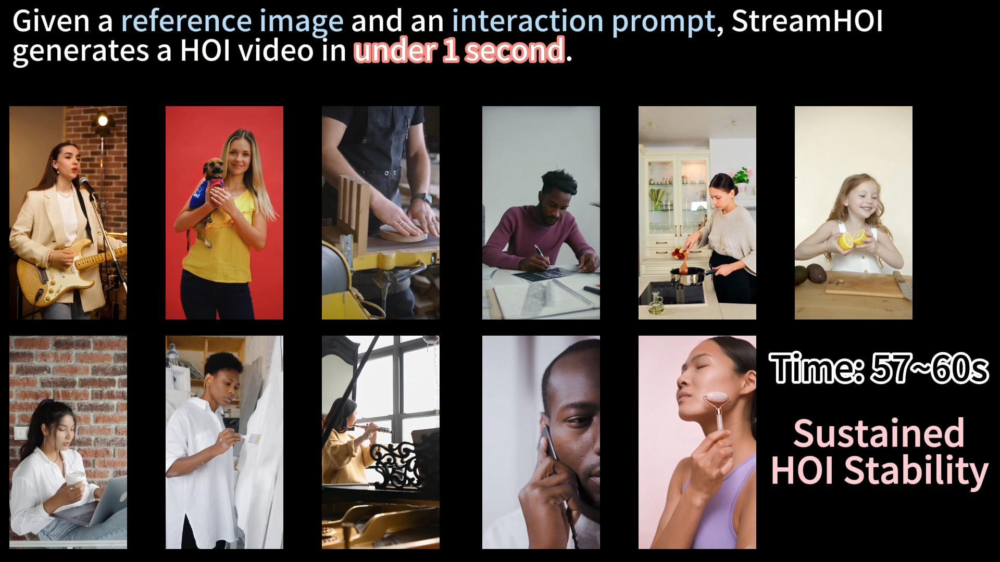
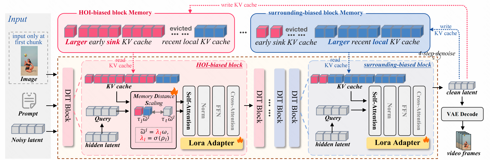

<h1 align="center">StreamHOI: Interaction-aware Temporal Context Adaptation for Streaming HOI Video Synthesis</h1>

<div align='center'>
    <a href='https://scholar.google.com/citations?user=8Fa9i4QAAAAJ&hl=en' target='_blank'><strong>Zejing Rao</strong></a><sup>1,*</sup>&emsp;
    <a href='' target='_blank'><strong>Haoxian Zhang</strong></a><sup>2</sup>&emsp;
    <a href='' target='_blank'><strong>Xiaoqiang Liu</strong></a><sup>2</sup>&emsp;
    <a href='' target='_blank'><strong>Yiping Meng</strong></a><sup>2</sup>&emsp;
    <a href='' target='_blank'><strong>Guoxin Zhang</strong></a><sup>2</sup>&emsp;
</div>

<div align='center'>
    <a href='' target='_blank'><strong>Pengfei Wan</strong></a><sup>2</sup>&emsp;
    <a href='https://scholar.google.com/citations?user=PdKElfwAAAAJ&hl=zh-CN' target='_blank'><strong>Fan Tang</strong></a><sup>1,&#9993;</sup>&emsp;
    <a href='' target='_blank'><strong>Tong-Yee Lee</strong></a><sup>3</sup>&emsp;
</div>

<div align='center'>
    <sup>1</sup> University of Chinese Academy of Sciences &emsp;
    <sup>2</sup> Kling AI Research &emsp;
    <sup>3</sup> National Cheng Kung University
</div>

<div align='center'>
    <small><sup>*</sup> Work done during internship at Kling AI Research</small>&emsp;
    <small><sup>&#9993;</sup> Corresponding author</small>
</div>

<br>

<div align="center">

[](https://arxiv.org/abs/2607.20174)
[](https://huggingface.co/KlingTeam)

</div>

**TL;DR:** **StreamHOI** is a low-latency streaming framework designed for **long-duration Human-Object Interaction (HOI) video generation**. While existing models rely on offline pipelines or compute-intensive frame-chaining, StreamHOI enables real-time generation (17.6 FPS) by optimizing how historical memory is structured within diffusion transformers to preserve long-term interaction consistency.


## Video Demo

<p align="center">
  <a href="https://www.youtube.com/watch?v=4fRkF5ajlKw">
    
  </a>
</p>

## Method Overview

<p align="center">
    
</p>

## Quick Start

1. Create the environment.

```bash
conda create -n stream_hoi python=3.11 -y
conda activate stream_hoi
pip install torch==2.5.1 torchvision==0.20.1 torchaudio==2.5.1 --index-url https://download.pytorch.org/whl/cu121
pip install -r requirements.txt
pip install flash-attn --no-build-isolation
```

2. Download the model weights.

This downloads:

| Repo | Used as |
| --- | --- |
| [`Wan-AI/Wan2.2-II2V-5B`](https://huggingface.co/Wan-AI/Wan2.2-TI2V-5B) | Wan2.2-TI2V backbone for video generation |
| [`KlingTeam/StreamHOI`](https://huggingface.co/KlingTeam/StreamHOI) | StreamHOI checkpoints, including `streamhoi_model.pt, streamhoi_lora.pt` |

The default layout is:

```text
checkpoints/streamhoi/
|-- wan_models/
    |-- Wan-AI/
      |-- Wan2.2-TI2V-5B/
|-- checkpoints/
    |-- streamhoi_model.pt
    `-- streamhoi_lora.pt
```


3. Run the demo.

```bash
bash inference.sh
```

Outputs are written to `demo/output`. 

For a single 40GB GPU, run :

```bash
python inference.py \
  --config_path $config_path \
  --data_path $data_path \
  --output_folder $output_folder\
  --generator_ckpt $generator_ckpt \
  --lora_ckpt $lora_ckpt \
  --cover_config
```
## Use Your Own Inputs

Prepare a CSV file with two columns: `path` (image path, relative to the project root) and `caption` (text description). 
For example, create my_data.csv:
| path | caption |
| --- | --- |
| my_images/img1.png | "A person is playing guitar in a room." |
| my_images/img2.png | "A woman is cooking in the kitchen." |

Put your first-frame images in the corresponding directory, then run: 

```bash
bash inference.sh
```

## Training

```bash
bash train_init.sh # uniform-sink
bash train_bmst.sh # bias-guided memory-specialized training (B-MST)
```
## Citation

If StreamHOI is useful for your research, please cite:

```bibtex
@misc{rao2026streamhoiinteractionawaretemporalmemory,
      title={StreamHOI: Interaction-aware Temporal Memory Adaptation for Streaming HOI Video Generation}, 
      author={Zejing Rao and Haoxian Zhang and Xiaoqiang Liu and Yiping Meng and Guoxin Zhang and Pengfei Wan and Fan Tang and Tong-Yee Lee},
      year={2026},
      eprint={2607.20174},
      archivePrefix={arXiv},
      primaryClass={cs.CV},
      url={https://arxiv.org/abs/2607.20174}, 
}
```

## Acknowledgements

StreamHOI builds on open research from [Self forcing](https://github.com/guandeh17/Self-Forcing), [Causal Forcing](https://github.com/thu-ml/Causal-Forcing), [Longlive](https://github.com/NVlabs/LongLive) and [Wan2.2](https://github.com/Wan-Video/Wan2.2).
